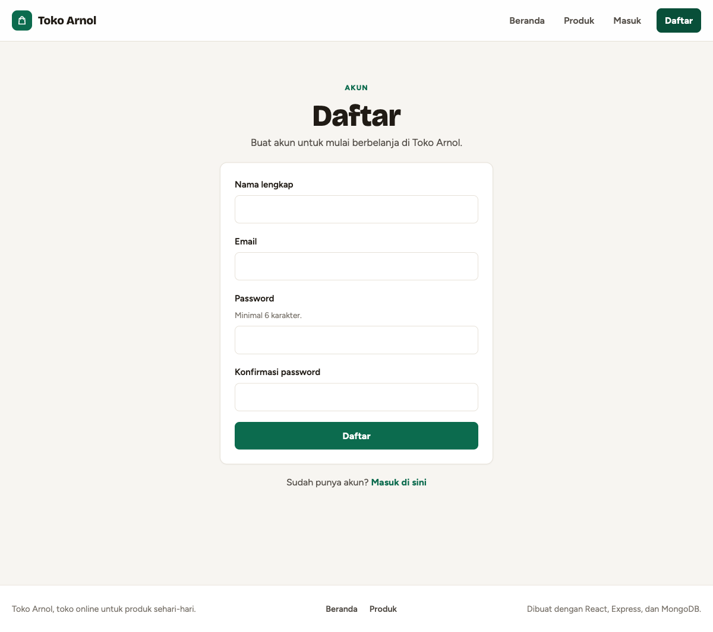
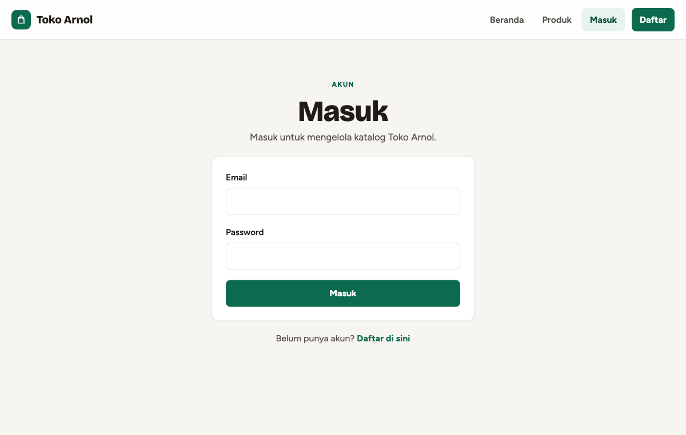
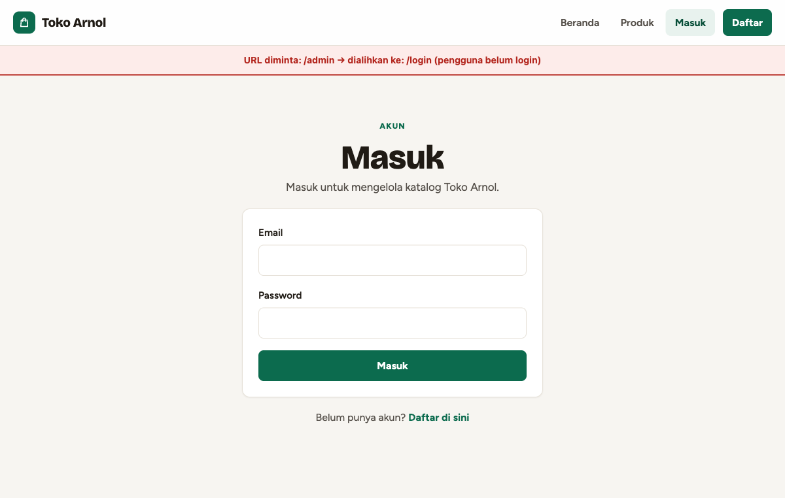
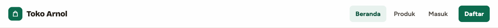
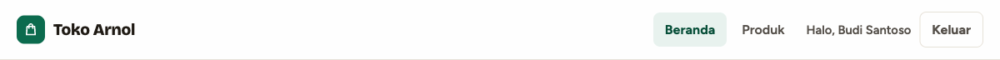
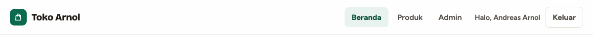
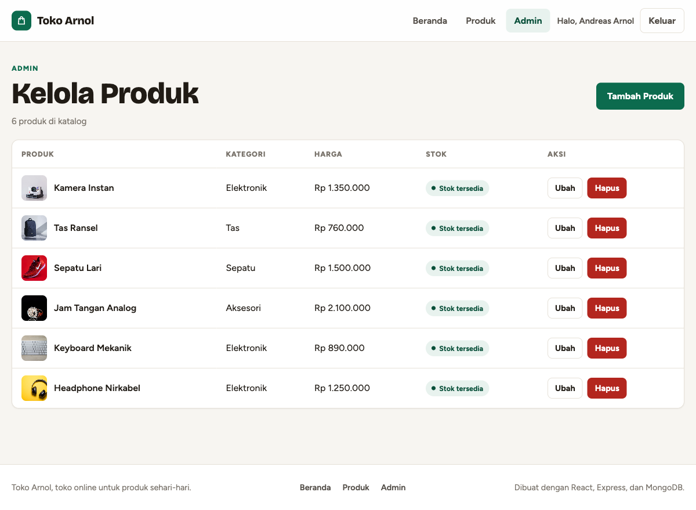
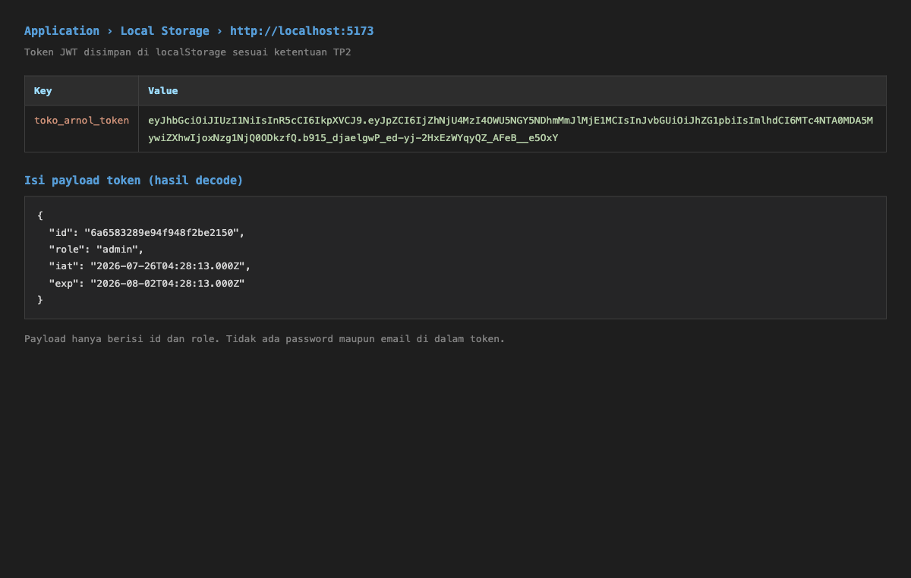

# Dokumentasi TP2 — Toko Arnol

**Nama:** Andreas Arnol
**NIM:** 2802631564
**Mata Kuliah:** Specialized Platform Development
**Tugas:** Tugas Personal Lab ke-2, Week 8

---

## 1. Link Deployment

| Bagian | Link |
| --- | --- |
| Frontend (Vercel) | https://toko-online.andreasarnol.com |
| Backend (Render) | https://api-toko-online.andreasarnol.com |
| Repository GitHub | https://github.com/andreasarnol02/bion-specialized-platform-dev-lab-1 |

Kedua domain memakai subdomain dari `andreasarnol.com` dengan sertifikat TLS yang diterbitkan otomatis oleh Vercel dan Render.

Akun demo untuk penilaian:

| Role | Email | Password |
| --- | --- | --- |
| Admin | demo@andreasarnol.com | 882cbad6e7be974a68a80d1e4ef74f7d |

Akun dengan role `user` bisa dibuat sendiri lewat halaman Daftar.

> **Catatan:** backend memakai paket gratis Render yang tidur setelah kurang lebih 15 menit tidak aktif. Permintaan pertama setelah tidur memerlukan waktu sekitar 50 detik. Silakan buka link backend lebih dulu dan tunggu sampai muncul respons JSON sebelum membuka frontend.

---

## 2. Ringkasan Pengerjaan

TP1 menghasilkan katalog produk dengan REST API dan operasi CRUD, tetapi halaman admin masih terbuka untuk siapa saja. TP2 menutup celah itu dan menambahkan deployment serta monitoring.

| Bobot | Fitur | Status |
| --- | --- | --- |
| LO3, 35% | Autentikasi JWT, halaman Login dan Registrasi, proteksi route | Selesai |
| LO4, 30% | Deployment backend ke Render, frontend ke Vercel | Selesai |
| LO4, 35% | Monitoring dengan Google Analytics 4 | Selesai |

---

## 3. Autentikasi JWT (LO3)

### 3.1 Model User

Koleksi `users` menyimpan `name`, `email`, `password`, dan `role`.

| Field | Aturan |
| --- | --- |
| `email` | Unik, otomatis huruf kecil, divalidasi formatnya |
| `password` | Minimal 6 karakter, di-hash bcrypt, `select: false` |
| `role` | Enum `user` atau `admin`, default `user` |

`select: false` pada `password` membuat Mongoose tidak pernah menyertakan hash dalam hasil query kecuali diminta eksplisit dengan `.select("+password")`. Satu-satunya tempat yang meminta adalah controller login. Dengan begitu tidak ada jalur kode yang bisa membocorkan hash secara tidak sengaja.

Password di-hash pada hook `pre("save")` dengan bcrypt (salt rounds 10). Hook memeriksa `isModified("password")` lebih dulu supaya operasi lain — misalnya mengubah role — tidak ikut mem-hash ulang hash yang sudah ada.

### 3.2 Alur token

1. Pengguna mengisi form Login atau Daftar.
2. Backend memverifikasi kredensial, lalu menandatangani JWT berisi `{ id, role }` dengan `JWT_SECRET`, masa berlaku 7 hari.
3. Frontend menyimpan token di `localStorage` dengan key `toko_arnol_token`.
4. Setiap permintaan yang mengubah data mengirim header `Authorization: Bearer <token>`.
5. Saat halaman dimuat ulang, frontend memanggil `GET /api/auth/me` untuk memastikan token masih sah. Token yang sudah kedaluwarsa langsung dihapus.

Langkah 5 penting: token bisa saja kedaluwarsa atau ditandatangani dengan secret lama. Memeriksa ke server adalah satu-satunya cara mengetahuinya dengan pasti. Tanpa itu, tampilan bisa menyapa pengguna dengan namanya padahal semua permintaannya sudah ditolak server.

### 3.3 Proteksi route

Proteksi diterapkan di dua lapis.

**Frontend** — komponen `ProtectedRoute` membungkus ketiga route admin:

| Status | Perlakuan |
| --- | --- |
| `loading` | Tampilkan indikator memuat |
| `guest` | Alihkan ke `/login`, ingat halaman tujuan |
| `authenticated` tapi bukan admin | Alihkan ke beranda |
| `authenticated` dan admin | Tampilkan halaman |

Status memakai tiga nilai, bukan boolean. Jika status awal langsung `guest`, refresh di `/admin` akan memantulkan pengguna ke `/login` sebelum token sempat dibaca.

Pengguna biasa dialihkan ke beranda, bukan ke `/login`, karena mereka sudah masuk — mengarahkan ke halaman login hanya akan berputar tanpa henti.

**Backend** — middleware `protect` memverifikasi tanda tangan JWT dan `requireAdmin` memeriksa role:

```js
router.route("/").get(getProducts).post(protect, requireAdmin, createProduct);
```

Endpoint baca tetap terbuka agar toko bisa dilihat pengunjung. Hanya operasi tulis yang dijaga.

Proteksi di frontend hanya untuk kenyamanan. Kontrol yang sebenarnya ada di backend: menghapus `ProtectedRoute` tidak memberi akses apa pun karena server tetap menolak.

### 3.4 Mengapa role `user` belum punya fitur khusus

Saat ini pengguna dengan role `user` bisa melakukan hal yang sama dengan pengunjung yang belum masuk, yaitu melihat katalog dan membuka detail produk. Perbedaannya hanya pada tampilan navbar.

Ini disengaja. Soal TP2 meminta tiga hal pada bagian LO3, yaitu halaman Login, halaman Registrasi, dan proteksi route. Keluaran yang diminta juga berbunyi "aplikasi toko online dengan fitur login & proteksi route". Fitur pelanggan seperti keranjang belanja, checkout, pesanan, dan pembayaran tidak disebut sama sekali, baik pada soal TP1 maupun TP2, sehingga tidak dikerjakan.

Yang dibangun di sini adalah lapisan identitasnya: siapa pengguna ini, apakah dia berhak, dan bagaimana haknya diperiksa di setiap permintaan. Urutan seperti ini juga dipakai pada pengembangan sungguhan — lapisan autentikasi dan otorisasi dibangun lebih dulu, baru fitur yang bergantung padanya. Ketika nanti keranjang belanja ditambahkan, `req.user` sudah tersedia di setiap endpoint yang dilindungi dan tidak ada yang perlu dirombak.

Role `admin` sengaja dipisahkan dari `user` justru karena alasan ini. Kalau semua akun yang terdaftar boleh mengubah katalog, aplikasi yang sudah bisa diakses publik akan membiarkan siapa pun menghapus seluruh produk hanya dengan mendaftar.

### 3.5 Bukti

**Halaman Daftar**



**Halaman Masuk**



**Proteksi route: membuka `/admin` tanpa login**



**Navbar, pengunjung belum masuk** — hanya Beranda, Produk, Masuk, dan Daftar.



**Navbar, masuk sebagai pengguna biasa** — muncul sapaan dan tombol Keluar, menu Admin tidak ada.



**Navbar, masuk sebagai admin** — menu Admin muncul.



**Halaman Kelola Produk, hanya bisa dibuka admin**



**Token JWT di `localStorage`**



Payload token hanya memuat `id` dan `role`; tidak ada password maupun email di dalamnya. Token pada gambar di atas ditandatangani dengan `JWT_SECRET` lokal untuk keperluan pengembangan, berbeda dengan secret yang dipakai di production.

> «SCREENSHOT: koleksi `users` di Atlas, memperlihatkan password tersimpan sebagai hash bcrypt»

---

## 4. Deployment (LO4)

### 4.1 Arsitektur

| Komponen | Layanan | Paket | Domain |
| --- | --- | --- | --- |
| Frontend | Vercel | Hobby | `toko-online.andreasarnol.com` |
| Backend | Render | Free | `api-toko-online.andreasarnol.com` |
| Database | MongoDB Atlas | M0 | — |

Kedua domain diarahkan lewat record CNAME di Cloudflare dengan proxy dimatikan (DNS only), sehingga Vercel dan Render menerbitkan sertifikat Let's Encrypt masing-masing. Dengan proxy menyala, permintaan validasi ACME dijawab lebih dulu oleh edge Cloudflare sehingga sertifikat tidak pernah terbit, dan mode SSL "Flexible" berpotensi menimbulkan redirect berulang.

Menentukan kedua domain sejak awal juga menghilangkan saling-tunggu antara kedua layanan: tanpa custom domain, `CLIENT_URLS` menunggu URL Vercel sementara `VITE_API_URL` menunggu URL Render.

Seluruh konfigurasi dikendalikan environment variable, sehingga kode yang sama berjalan di lokal maupun production tanpa perubahan.

| Layanan | Variabel |
| --- | --- |
| Render | `MONGODB_URI`, `JWT_SECRET`, `JWT_EXPIRES_IN`, `CLIENT_URLS`, `ADMIN_*` |
| Vercel | `VITE_API_URL`, `VITE_GA_MEASUREMENT_ID` |

`JWT_SECRET` dibuat otomatis oleh Render lewat `generateValue: true` pada `render.yaml`, jadi tidak pernah tersimpan di repository.

### 4.2 Rewrite SPA

`frontend/vercel.json` mengarahkan semua path ke `index.html`:

```json
{ "rewrites": [{ "source": "/(.*)", "destination": "/index.html" }] }
```

Vercel menyajikan hasil build sebagai file statis. Tanpa rewrite, membuka `/products/abc123` langsung membuat Vercel mencari file di path tersebut, tidak menemukannya, dan mengembalikan 404 sebelum React sempat dimuat. Gejalanya khas: berpindah halaman lewat tautan berhasil, tetapi refresh atau membuka link yang dibagikan gagal.

### 4.3 CORS

Backend memakai daftar origin yang diizinkan, dipisah koma lewat `CLIENT_URLS`:

```js
origin: (origin, callback) => {
  if (!origin) return callback(null, true);
  if (allowedOrigins.includes(origin)) return callback(null, true);
  callback(new Error(`Origin ${origin} tidak diizinkan oleh CORS`));
}
```

Daftar berisi string persis, bukan pola seperti `*.vercel.app`. `vercel.app` adalah domain bersama, sehingga pola semacam itu akan mengizinkan situs milik siapa pun yang kebetulan cocok.

Permintaan tanpa header `Origin` diizinkan agar curl dan script pengujian tetap bisa dipakai. Ini bukan pelemahan: browser selalu mengirim `Origin` pada permintaan lintas origin, dan klien non-browser memang tidak pernah tunduk pada CORS.

### 4.4 Urutan deployment

1. Buat cluster Atlas, daftarkan IP keluar Render pada Network Access.
2. Deploy backend ke Render, `CLIENT_URLS` diisi sementara.
3. Jalankan `npm run seed:admin` lewat Shell Render.
4. Deploy frontend ke Vercel dengan `VITE_API_URL` menunjuk ke URL Render.
5. Isi `CLIENT_URLS` di Render dengan URL Vercel yang sebenarnya.
6. Jalankan `smoke-test.sh` terhadap URL Render.

Langkah 5 paling sering terlewat, dan gejalanya menyesatkan: error CORS muncul di browser padahal API menjawab normal lewat curl.

Network Access pada Atlas dibatasi ke blok alamat keluar Render, yaitu `74.220.52.0/24` dan `74.220.60.0/24`, ditambah IP komputer sendiri untuk menjalankan script seed.

Pilihan yang lebih mudah adalah membuka `0.0.0.0/0`, dan itu memang yang direncanakan semula dengan alasan paket gratis Render dianggap tidak punya IP keluar tetap. Anggapan itu keliru: Render menampilkan blok IP keluarnya pada halaman service. Membatasi ke dua blok `/24` berarti hanya 512 alamat yang bisa mencoba terhubung, bukan seluruh internet. Kredensial dan TLS tetap menjadi lapisan pertama, sementara batas jaringan menjadi lapisan kedua.

Daftar IP keluar Render dapat berubah. Kalau suatu saat koneksi ditolak padahal kredensial benar, nilai terbaru bisa dilihat di halaman service Render bagian **Connect → Outbound**.

### 4.5 Bukti

> «SCREENSHOT: dashboard Render, service berstatus Live»
> «SCREENSHOT: daftar Environment Variables di Render»
> «SCREENSHOT: dashboard Vercel, deployment berstatus Ready»
> «SCREENSHOT: Atlas, koleksi `users` dan `products` terisi»
> «SCREENSHOT: aplikasi terbuka di URL publik Vercel»
> «SCREENSHOT: membuka `/products/:id` langsung lalu refresh, tetap tampil (bukti rewrite SPA)»
> «SCREENSHOT: output `./smoke-test.sh <URL Render>` memperlihatkan Passed: 7 Failed: 0»

---

## 5. Monitoring (LO4)

### 5.1 Google Analytics 4

Skrip `gtag.js` dimuat secara dinamis dari `VITE_GA_MEASUREMENT_ID`, bukan ditulis langsung di `index.html`. Dua alasannya: ID tetap menjadi environment variable, dan jika variabel kosong seluruh fungsi analytics menjadi tidak aktif — sehingga trafik pengembangan lokal tidak mencemari dashboard.

### 5.2 Pageview pada aplikasi satu halaman

Snippet bawaan GA4 mengirim `page_view` sekali saja, saat dokumen dimuat. React Router berpindah halaman lewat History API tanpa memuat dokumen baru, sehingga tanpa penanganan khusus seluruh sesi hanya tercatat sebagai satu pageview di `/`.

```js
const location = useLocation();
useEffect(() => {
  trackPageView(location.pathname + location.search);
}, [location.pathname, location.search]);
```

Pemanggilan `gtag("config", ...)` memakai `send_page_view: false` supaya pageview halaman pertama tidak terhitung dua kali — sekali oleh GA4 dan sekali oleh hook di atas.

Verifikasi harus dilakukan pada hasil `npm run build`, bukan `npm run dev`. Pada mode pengembangan, `React.StrictMode` sengaja menjalankan setiap effect dua kali untuk mendeteksi effect yang tidak aman diulang, sehingga jumlah event pada mode dev memang berlipat dua. Build production menghapus `StrictMode` dan jumlahnya kembali benar.

### 5.3 Event yang dikirim

| Event | Dipicu saat |
| --- | --- |
| `page_view` | Setiap perpindahan route |
| `sign_up` | Registrasi berhasil |
| `login` | Login berhasil |
| `logout` | Pengguna keluar |
| `view_item` | Halaman detail produk dimuat |
| `admin_product_create` | Produk ditambahkan |
| `admin_product_update` | Produk diubah |
| `admin_product_delete` | Produk dihapus |

`sign_up`, `login`, dan `view_item` memakai nama event bawaan GA4 sehingga langsung mengisi laporan standar tanpa perlu definisi kustom.

Tidak ada event yang membawa nama, email, atau token. Ketentuan GA4 melarang data yang bisa mengidentifikasi seseorang, dan event `admin_*` hanya mengirim id produk.

### 5.4 Bukti

> «SCREENSHOT: GA4 Realtime saat aplikasi dibuka»
> «SCREENSHOT: GA4 laporan Events memperlihatkan `login`, `sign_up`, `view_item`»
> «SCREENSHOT: GA4 laporan Pages and screens memperlihatkan beberapa path berbeda»

---

## 6. Catatan Keamanan

Beberapa keputusan diambil khusus untuk mengurangi risiko, di luar yang diminta secara eksplisit oleh soal.

### 6.1 Password tidak pernah tersimpan atau terkirim dalam bentuk asli

Password di-hash bcrypt dengan salt sebelum disimpan. Field-nya memakai `select: false` sehingga tidak ikut dalam respons API mana pun.

### 6.2 Pesan login tidak membocorkan email terdaftar

Email tidak dikenal dan password salah menghasilkan pesan yang sama persis, yaitu `"Email atau password salah"`. Pesan yang berbeda akan memungkinkan penyerang menebak email mana yang punya akun.

### 6.3 Waktu respons login dibuat seragam

Pesan yang sama saja ternyata belum cukup. Pada implementasi awal, email yang tidak ditemukan membuat proses berhenti lebih cepat karena bcrypt tidak sempat dijalankan:

| Kondisi | Sebelum perbaikan | Sesudah perbaikan |
| --- | --- | --- |
| Email terdaftar | 53,2 ms | 51,6 ms |
| Email tidak terdaftar | 1,2 ms | 51,9 ms |

Selisih 45 kali lipat itu cukup untuk mengurutkan daftar email berdasarkan waktu respons dan mengetahui mana yang terdaftar, meski semua responsnya berbunyi sama. Perbaikannya adalah selalu menjalankan satu perbandingan bcrypt, memakai hash dummy ketika akunnya tidak ada, lalu membuang hasilnya.

### 6.4 Pembatasan percobaan login

`/api/auth/login` dibatasi 10 percobaan gagal per IP per 15 menit; login yang berhasil tidak ikut dihitung. `/api/auth/register` dibatasi 20 permintaan per IP per jam untuk mencegah pembuatan akun massal.

Konsekuensinya perlu disadari: pengunjung yang berbagi satu IP publik — misalnya jaringan kampus — juga berbagi satu kuota. Membatasi berdasarkan email yang dikirim memang menghindari efek itu, tetapi justru membuat penyerang bisa berganti-ganti email tanpa pernah terkena batas. Risiko gangguan layanan dinilai lebih ringan daripada risiko penebakan password.

`/api/auth/me` sengaja tidak dibatasi karena dipanggil setiap halaman dimuat; batas yang cukup rendah untuk menahan serangan akan mengunci pengguna biasa hanya karena me-refresh beberapa kali.

### 6.5 Registrasi tidak bisa membuat admin

`POST /api/auth/register` selalu menetapkan `role: "user"` sebagai nilai literal dan mengabaikan field `role` pada request body. Karena aplikasi dapat diakses publik, endpoint yang bisa memberi hak admin sendiri akan memungkinkan siapa pun menghapus seluruh katalog.

### 6.6 Audit dependency

`npm audit` dijalankan pada kedua paket.

| Paket | Sebelum | Sesudah `npm audit fix` |
| --- | --- | --- |
| backend | 1 high, 1 low | 0 |
| frontend | 3 high | 2 high |

Dua temuan yang tersisa di frontend berasal dari satu advisory yang sama, yaitu *React Router: RSC Mode CSRF Bypass*. Perbaikannya menuntut react-router versi 8.3.0, sedangkan proyek ini memakai 7.18.1 — sebuah lompatan versi mayor yang berpotensi merusak seluruh routing.

Advisory tersebut ditelaah lebih dulu sebelum diputuskan, dan hasilnya kerentanan itu tidak dapat dicapai pada aplikasi ini:

| Yang diperiksa | Hasil |
| --- | --- |
| Impor `react-router/rsc` | tidak ada |
| `loader` atau `action` pada route | tidak ada |
| `createBrowserRouter` / `RouterProvider` | tidak ada |
| File konfigurasi framework mode | tidak ada |

Aplikasi ini murni SPA sisi klien dengan `BrowserRouter` dan `Routes`, sehingga tidak ada RSC mode yang bisa dilewati maupun server action yang bisa dieksekusi. Menjalankan `npm audit fix --force` hanya akan memaksa upgrade mayor yang berisiko merusak routing yang sudah diuji, demi menutup celah yang jalur kodenya tidak pernah dipakai.

Keputusannya: temuan ini dicatat sebagai tidak berlaku, bukan diabaikan. Upgrade ke react-router 8 dijadwalkan terpisah dari pengerjaan tugas ini agar bisa diuji ulang dengan benar.

### 6.7 Risiko yang diterima dan tidak diperbaiki

`POST /api/auth/register` menjawab `"Email sudah terdaftar"` ketika email sudah dipakai. Respons ini memang membocorkan email mana yang punya akun. Menutupnya berarti selalu menjawab berhasil lalu mengirim email verifikasi, dan alur email berada di luar cakupan tugas ini. Risiko ini dicatat dan diterima, bukan diabaikan.

### 6.8 Penyimpanan token

Soal mensyaratkan token disimpan di `localStorage`, dan itu yang diterapkan. Perlu dicatat bahwa cookie `httpOnly` lebih aman karena isinya tidak dapat dibaca JavaScript sehingga lebih tahan terhadap serangan XSS. Sebagai gantinya, cookie membutuhkan penanganan `SameSite` dan CORS yang lebih ketat karena browser mengirimkannya otomatis.

Perlu dicatat pula bahwa dengan `localStorage` dan header `Authorization`, CORS bukan batas keamanan utama: situs lain tetap tidak bisa membaca token karena `localStorage` dipisahkan per origin. Batas keamanan yang sesungguhnya adalah verifikasi tanda tangan JWT di server.

---

## 7. Cara Menjalankan Secara Lokal

Petunjuk lengkap ada di `README.md`. Ringkasnya:

```bash
# 1. Jalankan MongoDB
brew services start mongodb-community

# 2. Salin file environment
cp backend/.env.example backend/.env
cp frontend/.env.example frontend/.env
# isi JWT_SECRET dengan hasil: openssl rand -hex 32

# 3. Backend
cd backend && npm install && npm run seed:admin && npm run dev

# 4. Frontend, di terminal kedua
cd frontend && npm install && npm run dev
```

Buka `http://localhost:5173`.

Untuk menguji alur autentikasi dari ujung ke ujung:

```bash
cd backend && ./smoke-test.sh
```

---

## 8. Kendala dan Solusi

| Kendala | Solusi |
| --- | --- |
| Paket gratis Render tidur setelah kurang lebih 15 menit | Permintaan pertama butuh sekitar 50 detik; backend dibuka lebih dulu sebelum demo |
| Atlas menolak koneksi dari Render, deploy gagal dengan `Could not connect to any servers` | Blok IP keluar Render (`74.220.52.0/24`, `74.220.60.0/24`) didaftarkan pada Network Access Atlas, bukan membuka `0.0.0.0/0` |
| Paket gratis Render tidak punya Shell, sehingga `npm run seed:admin` tidak bisa dijalankan di server | Script dijalankan dari komputer lokal dengan `MONGODB_URI` menunjuk ke Atlas; IP komputer ikut didaftarkan di Network Access |
| Refresh di route selain `/` menghasilkan 404 di Vercel | Ditambahkan rewrite SPA pada `vercel.json` |
| Error CORS setelah frontend dideploy | `CLIENT_URLS` di Render diisi URL Vercel yang sebenarnya |
| Refresh di `/admin` sempat memantul ke `/login` | Status auth diubah menjadi tiga nilai, `ProtectedRoute` menunggu status `loading` selesai |
| Jumlah event GA4 terlihat dua kali lipat | Ternyata efek `React.StrictMode` pada mode pengembangan; diverifikasi ulang memakai hasil build production |
| Waktu respons login membocorkan email terdaftar | Login selalu menjalankan satu perbandingan bcrypt, memakai hash dummy bila akun tidak ditemukan |

---

## 9. Struktur Kode yang Ditambahkan

**Backend**

| File | Fungsi |
| --- | --- |
| `src/models/User.js` | Skema user, hashing bcrypt, `matchPassword`, `toSafeObject` |
| `src/middleware/auth.js` | `protect` dan `requireAdmin` |
| `src/middleware/rateLimiter.js` | Pembatasan percobaan login dan registrasi |
| `src/controllers/authController.js` | `register`, `login`, `getMe` |
| `src/routes/authRoutes.js` | Route `/api/auth` |
| `src/utils/generateToken.js` | Penandatanganan JWT |
| `src/scripts/seedAdmin.js` | Pembuatan admin pertama |
| `smoke-test.sh` | Pengujian alur auth dari ujung ke ujung |

**Frontend**

| File | Fungsi |
| --- | --- |
| `src/api/client.js` | `apiFetch`: base URL, header Bearer, penanganan 401 terpusat |
| `src/api/auth.js` | Pemanggilan endpoint auth |
| `src/context/AuthContext.jsx` | Status auth tiga nilai, validasi token saat halaman dimuat |
| `src/components/ProtectedRoute.jsx` | Penjaga route admin |
| `src/pages/Login.jsx`, `src/pages/Register.jsx` | Halaman autentikasi |
| `src/utils/analytics.js` | Pemuatan GA4 dan pengiriman event |
| `src/hooks/useAnalytics.js` | Pageview setiap perpindahan route |

**Konfigurasi**

| File | Fungsi |
| --- | --- |
| `render.yaml` | Blueprint deployment Render |
| `frontend/vercel.json` | Rewrite SPA |
